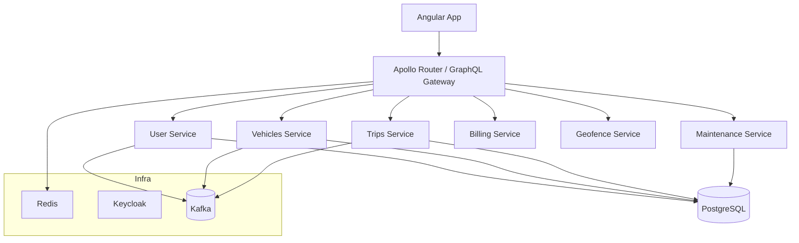

<div align="center">

# Hi, I'm **Khalil Krifi** (DaL1ght1) 👋


<p>
  <a href="https://dal1ght1.github.io/Portfolio/">
    
  </a>
  <a href="https://www.linkedin.com/in/khalil-krifi/">
    
  </a>
  <a href="mailto:khalil.krifi@ensi-uma.tn">
    
  </a>
</p>

<p>
  
  
  
</p>

</div>


---

## 🧰 Tech stack

> Everything I’ve used across projects & internships.

### Languages


### Frontend


### Backend & APIs


### ML / Data Science


### Data & Messaging


### Big Data & Distributed


### Data Tools & ETL


### DevOps & Platform


### Auth & Identity


### Realtime & Automation


---

## 🚀 Featured projects

* **SmartStreet — Intelligent Fleet Management** <br>
  Angular + Spring Boot microservices with **GraphQL federation**, **Keycloak** auth, **Kafka**, **Redis**, and Docker‑based dev stack. Real‑time tracking, trips, maintenance, billing, geofencing.
  Repo: [`Fleet-Management`](https://github.com/DaL1ght1/Fleet-Management)

* **FIDS — Falsified Image Detection System** <br>
  Forensic web app with **Angular UI** + **Spring Cloud microservices** and **PyTorch** models. Adds **Explainable AI** (Grad‑CAM, LIME, SHAP), report generation, and RBAC for legal/forensic roles.
  Repo: [`PCD-2025-40`](https://github.com/DaL1ght1/PCD-2025-40)

* **ECM — Enterprise Content Management (PoC)** <br>
  Angular + Spring Boot + PostgreSQL with JWT auth, drag‑and‑drop, admin dashboard, and Swagger/OpenAPI docs.
  Repo: [`ECM`](https://github.com/DaL1ght1/ECM)

* **Portfolio (Next.js + TypeScript + Tailwind)** <br>
  Personal site (Next.js + Shadcn/UI) with dark/light theme, projects, resume, and contact.
  Live: [https://dal1ght1.github.io](https://dal1ght1.github.io) • Repo: [`Portfolio`](https://github.com/DaL1ght1/Portfolio)

* **Universal ML Analytics (Streamlit)** <br>
  Upload any dataset → smart problem detection (classification/regression), model training, evaluation, and **XAI** (SHAP, LIME) with clean UI.
  Repo: [`ML-Analytics`](https://github.com/DaL1ght1/ML-Analytics)

* **Directory‑Content‑Collector (Python)** <br>
  One‑file utility to concatenate readable source files across a repo into a single, well‑separated text snapshot (handy for sharing or LLM context).
  Repo: [`Directory-Content-Collector`](https://github.com/DaL1ght1/Directory-Content-Collector)

---

## 🏗️ Architecture snapshots

<details>
<summary><b>FIDS — Microservices + XAI (high level)</b></summary>

```mermaid
flowchart LR
  UI[Angular UI] --> GW[Spring Cloud Gateway]
  GW --> US[User Service]
  GW --> IMS[Image Management]
  GW --> IAS[Image Analysis (PyTorch + XAI)]
  GW --> RS[Report Service]

  US -->|auth + JWT| PG[(PostgreSQL)]
  IMS -->|GridFS| MDB[(MongoDB)]
  IAS -->|events| KAFKA[(Apache Kafka)]
  RS --> MDB

  subgraph Observability
    ZP[Zipkin]
    PM[Prometheus]
  end
  US --> ZP
  IMS --> ZP
  IAS --> ZP
  RS --> ZP
```

</details>

<details>
<summary><b>SmartStreet — GraphQL federation (excerpt)</b></summary>



</details>

---

## 📊 Stats

<div align="center">

<a href="https://github.com/DaL1ght1">
  
</a>
<a href="https://github.com/DaL1ght1">
  
</a>

<a href="https://github.com/DaL1ght1">
  
</a>

<a href="https://github.com/DaL1ght1">
  
</a>

</div>

> *Tip:* If any image widgets don’t load, they might be rate‑limited by their free hosts. They usually recover on refresh.

---

## 🤝 Let’s connect

* Portfolio: **[https://dal1ght1.github.io](https://dal1ght1.github.io)**
* LinkedIn: **[https://www.linkedin.com/in/khalil-krifi/](https://www.linkedin.com/in/khalil-krifi/)**
* Email: **[khalil.krifi@ensi-uma.tn](mailto:khalil.krifi@ensi-uma.tn)**

---

<!-- NOTES FOR YOU (do not include in README when committing):
If you want, I can add repo badges for each featured project (build, license, tech) or trim this into a lighter version for mobile screens. -->
